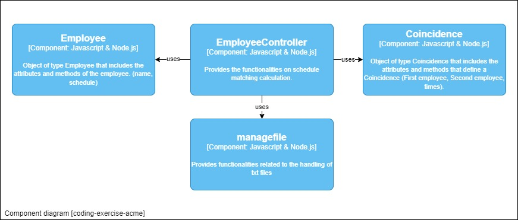
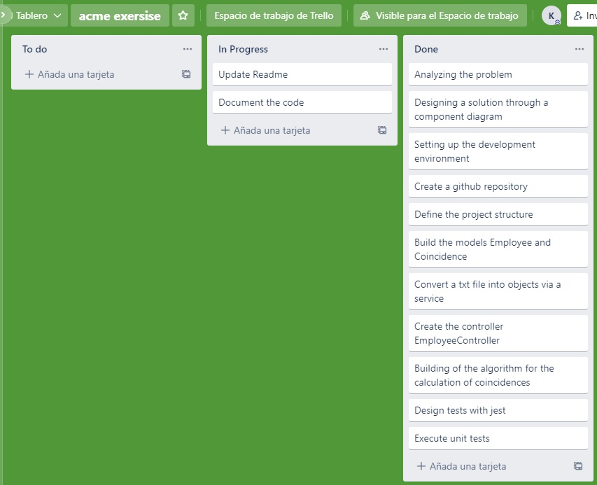

# ACME EXERCISE

This is a program to calculate the number of times ACME employees have been in the office in the same period of time.

It is an exercise to evaluate skills for the ioet developer job. The acme exercise was developed using nodejs.

Contents
========
 * [Problem Description](#problem)
 * [Installation](#installation)
 * [Arquitecture](#arquitecture)
 * [Approach and Methodology](#approach-and-methodology)

## Problem

The company ACME offers their employees the flexibility to work the hours they want. But due to some external circumstances they need to know what employees have been at the office within the same time frame

The goal of this exercise is to output a table containing pairs of employees and how often they have coincided in the office.

__Input__: the name of an employee and the schedule they worked, indicating the time and hours. This should be a .txt file with at least five sets of data.

```text
RENE=MO10:00-12:00,TU10:00-12:00,TH01:00-03:00,SA14:00-18:00,SU20:00- 21:00
ASTRID=MO10:00-12:00,TH12:00-14:00,SU20:00-21:00
ANDRES=MO10:00-12:00,TH12:00-14:00,SU20:00-21:00
```
__Output__: indicates the number of times employees have coincided (the order could change).
```text
ASTRID-RENE: 2
ASTRID-ANDRES: 3
RENE-ANDRES: 2
```

## Installation

This project requires [Node.js](https://nodejs.org/) to run.

Clone the project:
```sh
git clone https://github.com/KryzAle/coding-exercise-acme
```

Install the dependencies and devDependencies and start the server.
```sh
cd coding-exercise-acme
npm install
npm start
```

For Run Test...

```sh
npm run test
```

## Arquitecture

For the development of this exercise I have considered the c4 architecture which describes the interaction between components.


## Approach and Methodology

This problem has been solved using a controller, model and service oriented approach, first I performed an analysis of the provided file and identified the features needed to convert the information into objects.
Then I proceeded to generate the possible combinations between pairs of employees and convert them into objects of type Coincidence. 
Finally the schedules of each pair of employees are compared and in case there are coincidences the timesCoincidence attribute is modified with the calculated values.

The strategy for solving the problem was to divide it into sub-problems or sub-tasks 

#### Subproblems / subtasks
- Building the models: Employee - Coincidence.
- Create a service to handle the file and convert it into objects.
- Building a controller that handles the objects to obtain the schedule coincidences.
- Design the necessary tests to validate the input information and validate the functionalities.
- Develop the solution to the problem and validate that all tests pass.

To manage the tasks use trello with the kanban methodology.
